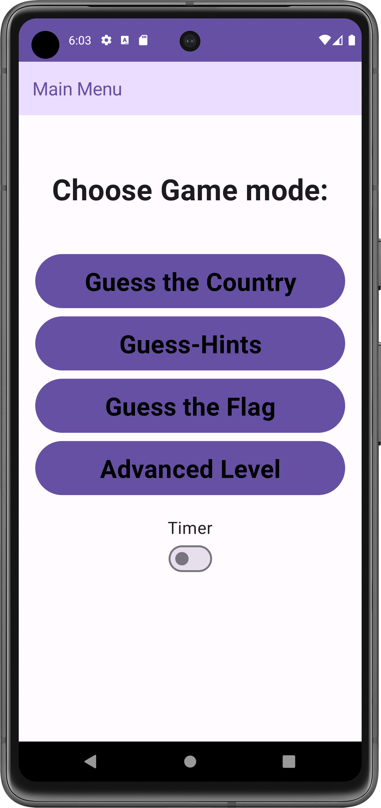
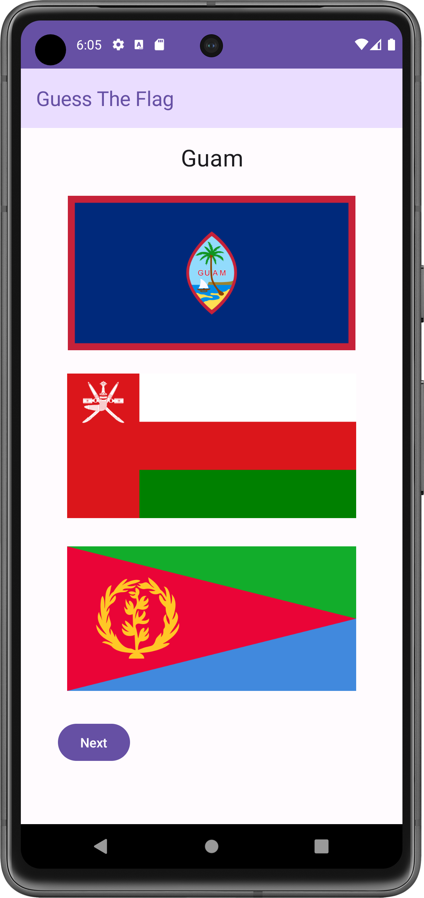
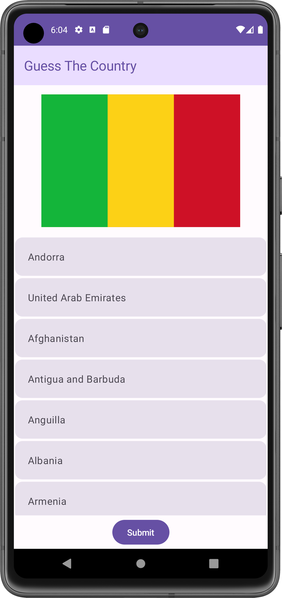
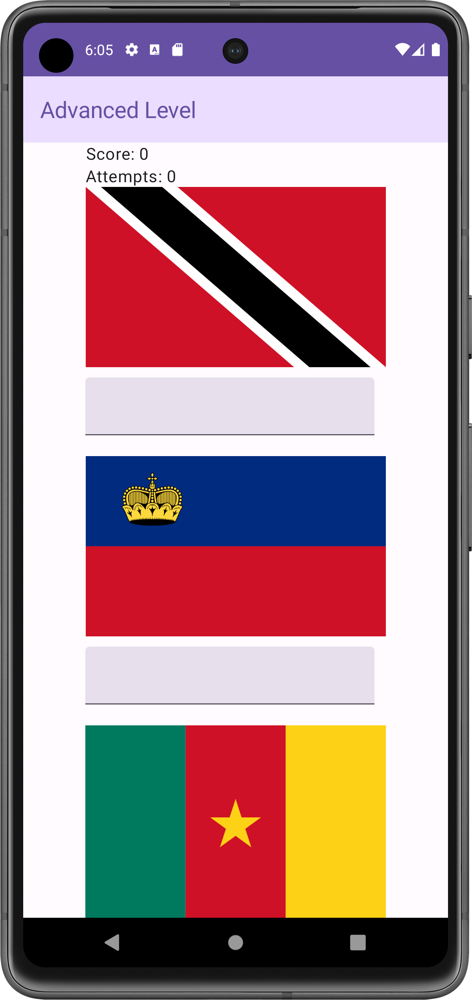

# Guess the Country

## Description

"Guess the Country" is an Android application built with Jetpack Compose. The app presents users with a fun and interactive game where they can guess the names of countries based on their flags. The application includes multiple levels and features to enhance user engagement and learning.

## Features

- **Basic Level:**
  - Display a random country name and its flag.
  - Allow the user to guess the country's name by inputting characters.
  - Display a message indicating whether the guess is correct or incorrect.
  - Track the number of attempts and display appropriate messages.

- **Advanced Level:**
  - Display 3 random unique flags and text boxes for user inputs.
  - Allow the user to guess the names of all 3 displayed flags.
  - Display messages indicating correctness of guesses and color-code text boxes based on correctness.
  - Limit the number of attempts to 3.

- **Score Tracking:**
  - Track and display the user's score based on the number of correct guesses.

- **Countdown Timer:**
  - Implement a countdown timer that triggers a message when time is up.

## Screenshots







## Installation

1. Clone the repository:
   ```bash
   git clone https://github.com/minolFernando05/Mobile-Application-Development-CW1.git
